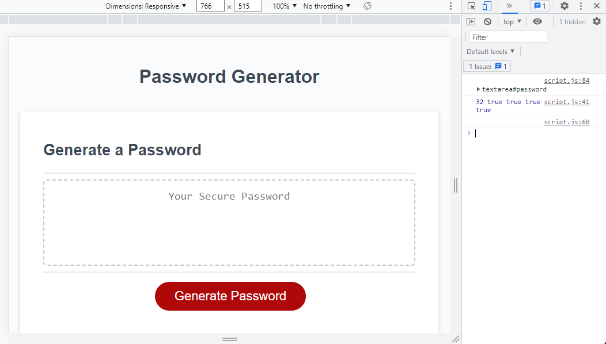

# java-week-three

This webpage allows you to make a large variety of passwords by allowing the user to choose from different arrays and different lengths. After clicking the generate button- the user will be brought through a series of prompts that allows the user to pick and choose exactly how they want the password to be written.

[a link](https://davercodes.github.io/java-week-three/)

##PleaseRead
its deeply unfortunate that I dont know off hand how to change the root of my repo- hopefully I will discover how before its too late

This website had its easy and hard parts. I am very happy with my prompt readout and how it is visible through the console regarding seeing what the user chose as a number, and if they clicked ok or cancel to proceed through the process. I also belive the mathmatics are properly defined. But for whatever reason connecting the two has proven to be the most difficult part. 
